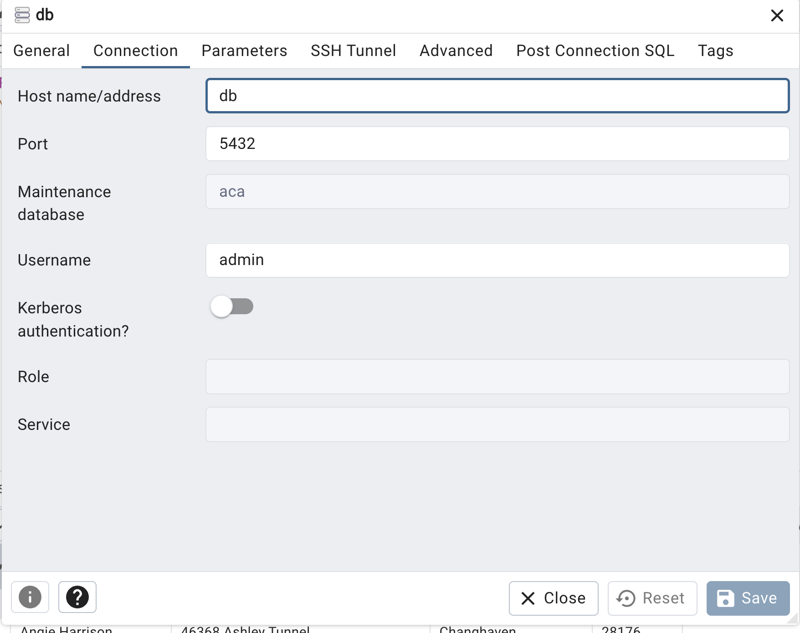

# Stored Procedures  and User Defined Functions in PostgreSQL

## Presentation

Visit [here](https://hovhannisyan91.github.io/aca/#/)


## How it works?


### Project Structure

Here’s an overview of the project’s file structure:

```bash
.
├── README.md
├── .env                # Environment variables
├── docker-compose.yml  # Docker Compose configuration
├── img                 # screenshots
├── sql                 # sql init files
│   ├── 01_schema.sql   # building the schema
│   ├── 02_et.sql       # inserting the csv file
│   ├── 02_functions_and_procedures.sql # functions and procedures (optional)
└── docs                # Documentation assets
    ├── imgs            # Image assets for documentation
    └── index.html      # Presentation 
```

### Docker 

This repository sets up a Docker environment with **two** main services:

1. **PostgreSQL:** for data storage
2. **pgAdmin:** for database management and visualization


### Prerequisites

Before running this setup, ensure Docker and Docker Compose are installed on your system.


- Docker: [Install Docker](https://docs.docker.com/get-docker/)
- Docker Compose: [Install Docker Compose](https://docs.docker.com/compose/install/)


### How to Run?

### Runing

Given that Docker Engine is running, open a terminal where the `docker-compose.yaml` is located and type:

```bash
docker-compose up --build
```

### Removing containers

```bash
docker-compose down
```


### DB

After successfully running the services, now you can view the database by using pgadmin's web interface.

- Access **pgAdmin** for PostgreSQL management: [http://localhost:5050](http://localhost:5050)
    - username: `admin@admin.com` 
    - password: `admin`
    - hostname must be the same as the postgres service name in `docker-compose.yaml`, which is `db`
    - When running for the first time, you must create a server. Configure it as shown in the below image (Password is blurred it should be `password`.)
    

### Environment Variables

Create a `.env` file in the **root** directory to define your environment variables as below:

```bash
# PostgreSQL configuration
DB_USER=<your_database_user>
DB_PASSWORD=<your_database_password>
DB_NAME=<your_database_name>

# pgAdmin configuration , you MUST NOT change bellow credentials
PGADMIN_EMAIL=admin@admin.com
PGADMIN_PASSWORD=admin
```

### **Good Luck**