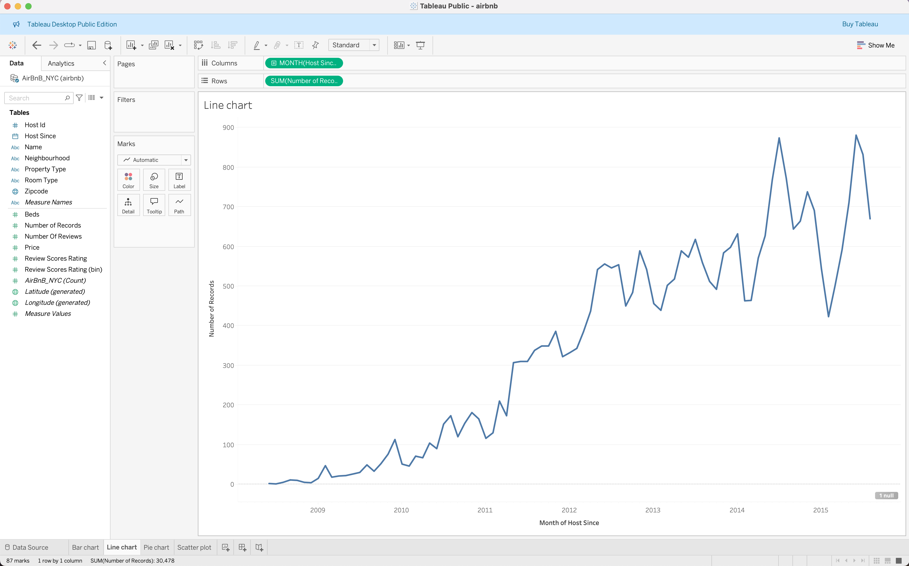
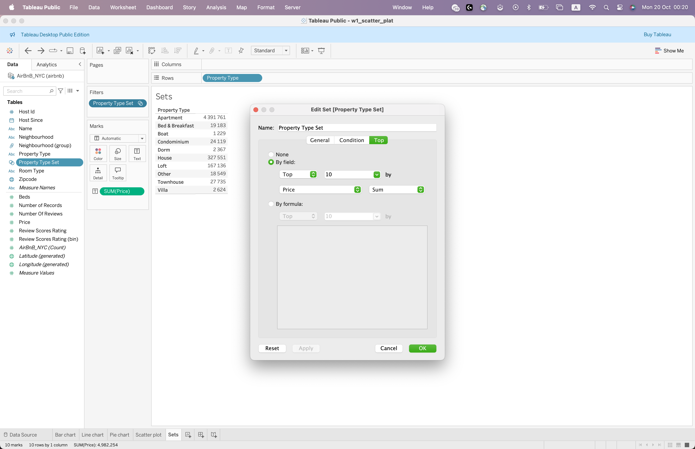

# Tableau Tutorial

## Introduction to Tableau

- **Week 1: Intro**
  - Connect to basic data sources (Excel, CSV)
  - Workbooks  
  - Data types  
  - Dimensions vs. Measures  
  - Discrete vs. Continuous fields  
  - Tableau interface (shelves, marks, filters, dashboards, buttons)  
  - Create basic charts: bar, line, pie, scatter  
  - Use filters, groups, sets, and sorting  
  - **Task:** Publish your first simple dashboard

#### Connect to basic data sources (Excel, CSV)
**Tableau Products**
- Tableau Server: On-premise platform that enables organizations to share dashboards privately
- Tableau Cloud: Cloud-based platform for sharing and managing dashboards without needing any server infrastructure
- Tableau Public: Free, cloud-based platform that enables Tableau enthusiasts to publish their dashboards
- Tableau Next: Automated insight generation and trend detection
- Tableau Desktop: Tool for creating visualizations and publishing them on Tableau Cloud, Tableau Server or Tableau Public
- Tableau Prep: Data preparation tool

**Tableau File Types**
- Workbooks (.twb)
- Bookmarks (.tbm)
- Packaged Workbooks (.twbx)
- Extract (.hyper)
- Data Source (.tds)
- Packaged Data Source (.tdsx)

**Tableau Desktop Public Edition** enables making visualizations and managing dashboards
- **Online**
- **Offline**

[Download Tableau Public](https://www.tableau.com/products/public/download?_gl=1*3ee3yj*_ga*MTUyMTIzMjE1MS4xNjk2NjY4MDg2*_ga_8YLN0SNXVS*czE3NjA4NTk1MDckbzE0MyRnMSR0MTc2MDg1OTUyMiRqNjAkbDAkaDA.)

[Sample Datasets](https://public.tableau.com/app/learn/sample-data?_gl=1*r8r2je*_ga*NzIyOTQ4NzUzLjE3NjA4NjY5NjY.*_ga_8YLN0SNXVS*czE3NjA4NjY5NjUkbzEkZzAkdDE3NjA4NjY5NjUkajYwJGwwJGgw)

Dataset Name: **airbnb.xlsx**

#### Data Types
- Number (Decimal)
- Number (Whole): [Host ID]
- Date: [Host Since]
- Date & Time
- String: [Property Type]
- Geographic Role: [Zip Code]
- Boolean values

#### Dimensions vs Measures
- Dimensions typically contain qualitative values (such as names, dates, or geographical data) and are used to categorize the data.
- Measures are aggregated. Measures typically contain numeric, quantitative values that you can measure. 

#### Discrete vs Continuous
- **Discrete:** individually separate and distinct — `Name`
- **Continuous:** forming an unbroken whole, without interruption — `SUM(Number of Reviews)`

#### Field Types
1. Discrete Dimension: A discrete dimension breaks data into distinct categories. 
2. Discrete Measure: A numerical measure that treated as a set of distinct values.
3. Continuous Dimension: A numeric or date dimension displayed across a continuous axis. 
4. Continuous Measure: The most common type — numeric values shown across a continuous axis.

*Note: Dimensions with a data type of String or Boolean can’t be continuous. Dates are the most common continuous dimension.*

You can convert measures from discrete to continuous or from continuous to discrete. Click the field and choose Discrete or Continuous.

|  |  |
|:--:|:--:|
| **Continuous** | **Discrete** |

#### Tableau Interface (shelves, marks, filters, dashboards, buttons)
Main sections:
- **A:** Data Pane – contains all fields (dimensions, measures, parameters)
- **B:** Shelves – control how fields appear in your view
- **C:** Marks Card – controls visual elements (color, size, shape, label)
- **D:** Filters Shelf – limits data shown in the view
- **E:** Dashboard Pane – combines multiple sheets into one display
- **F:** Toolbar & Buttons – quick access to tools (undo, redo, sort, etc.)

#### Create Basic Charts
|  |  |  |  |
|:--:|:--:|:--:|:--:|
| Bar Chart | Line Chart | Pie Chart | Scatter Plot |

#### Use Filters, Groups, Sets, and Sorting
|  |  |  |  |
|:--:|:--:|:--:|:--:|
| Filters | Groups | Sets | Sorting |

---

- **Week 2: Intermediate Visual Analytics**
  - Connect to databases (PostgreSQL)
  - Work with data joins, blends, unions, and relationships
  - Get CSV from SQL Stored Procedure using Python 
  - Dual-axis charts, histograms, boxplots, heatmaps
  - Calculated fields (row-level vs aggregate)  
  - Parameters (interactive filtering) 
  - Types of filters 
  (including dashboard actions)
  - **Task:** Build dashboards with interactivity (actions, filters, tooltips)

#### Work with Data Joins, Blends, Unions, and Relationships

## Relationships
- Links tables **logically** without merging them into a single table.
- Tableau queries tables **only when needed** and manages aggregation automatically.
- Best for **fact and dimension tables** (one-to-many or many-to-many).
- Prevents **row duplication** in aggregated views.

## Join Types
- Combines tables **horizontally** into a single table based on matching keys.
- **Inner Join:** Only rows that exist in **both tables**.
- **Left Join:** All rows from **left table**, matched rows from right, nulls if no match.
- **Right Join:** All rows from **right table**, matched rows from left, nulls if no match.
- **Full Outer Join:** All rows from **both tables**, nulls if no match.
- Can **duplicate rows** in one-to-many relationships.

## Union
- Combines tables **vertically** by stacking rows.
- Requires **matching columns** (extra columns will be null).
- Best for **tables/files with the same schema** (e.g., monthly sales files).
- Increases **row count**, does not merge columns.

## Blend
- Combines data from **different sources** at the **aggregate level**.
- Primary data source drives the view; secondary source provides linked measures/dimensions.
- Can handle **different levels of detail** across sources.
- Useful when joining across **databases or published data sources**.

---

### Data Model
 

1. **Logical Layer (Relationships Layer)**  
   - Default view you see first.  
   - Connect tables using relationships — shown as flexible lines: noodles.

2. **Physical Layer (Joins and Unions Layer)**  
   - Each logical table is made up of one or more physical tables.  
   - Combine tables directly using joins or unions.

---

# JOIN vs UNION vs RELATIONSHIP vs BLENDING in Tableau

| Feature / Method           | **UNION** | **JOIN** | **RELATIONSHIP** | **BLEND** |
|-----------------------------|----------|----------|-----------------|-----------|
| **Layer**                   | Physical Layer | Physical Layer | Logical Layer | Visualization Level |
| **Multiple Data Sources**   | ❌ | ❌ | ❌ | ✅ |
| **Merge Tables**            | ✅ | ✅ | ❌ | ❌ |
| **Flexibility**             | Static | Static | Flexible | Very Flexible *(Page by Page)* |
| **Join Types**              | n/a | Inner, Left, Right, Full | All | Left |

---

### Notes
- **Union** combines tables **vertically** (adds rows)  
- **Join** combines tables **horizontally** (adds columns)  
- **Relationship** connects logical tables flexibly based on data context  
- **Blending** merges **different data sources** at the visualization level  

### How To Do
|  |  |  |
|:--:|:--:|:--:|
| Relationship | Join | Union |

### Differences in Action
|  |  |  |
|:--:|:--:|:--:|
| Relationship | Join | Blend |

*Note: In joins, the same row can be duplicated multiple times; the SUM of [Order Total] may be inflated.*

---

#### Types of filters 

When Tableau applies filters, it follows this logical order:

1. **Extract Filters**
2. **Data Source Filters**
3. **Context Filters**
4. **Dimension Filters**
5. **Measure Filters**

---

##  1. Extract Filters
- **Purpose:** Limit data *before* Tableau loads it into memory.  
- **Example (Orders Dataset):**
  - `Year = 2023` so Tableau only loads 2023 records.  
  - This improves speed and shows only relevant values.
 
---

##  2. Data Source Filters
- **Purpose:** Restrict data for *all* users of a data source.  
- **Example:**
  - `[Region] = "West"` as a data source filter to limit analysis to western U.S. orders.  
  - When datasource is published, everyone using it will only see West region data.

---

##  3. Context Filters
- **Purpose:** Define the *primary filter* that sets the context for others.  
- **Example:**
  - `[Year] = 2023` as a **context filter**, then filter `[Quarter]`.  
  - Tableau first filters 2023 data, then applies quarter filter (Q1–Q4).  
  - This avoids re-querying the full dataset each time.

|  |  | 
|:--:|:--:|
| Year | Quarter |

---

##  4. Dimension Filters
- **Purpose:** Filter categorical fields like Region, Product Category, or Customer Name.  
- **Examples:** 
 - Filter by `[Customer name]`.   

---

##  5. Measure Filters
- **Purpose:** Filter numerical fields like `OrderTotal`, `Quantity`, `Unite Price` or `Discount`.  
- **Examples:**
  - Filter `[Unite Price] >= 100` to analyze only high-value purchases.  

  

---

##  6. Date Filters
- **Purpose:** Limit by specific dates or dynamic time ranges.  
- **Examples:**
  - Show only orders from the **last quarter** → `[OrderDate] → Relative Date → Last 1 Quarter`.  
  - View all orders **between Jan 1 and Mar 31, 2023**.  
  - Compare **Q1 vs Q2 2023** in a dashboard using a filter action.

---

##  7. Top N Filters
- **Purpose:** Display only the top or bottom performers based on a measure.  
- **Examples:**
  - **Top 10 Customers by SUM(OrderTotal)**  
  - **Bottom 5 Products by Quantity Sold**
- **Tableau Action:**
  - Right-click `[CustomerName]` → Filter → *Top* → “By field” → `SUM(OrderTotal)` → Top 10.

---

##  8. Interactive (Quick) Filters
- **Purpose:** Give users control to filter in dashboards.  
- **Example:**
  - Right-click `[Region]` → *Show Filter* → choose “Dropdown” or “Single Value List.”  
  - In your dashboard, users can dynamically select “West” or “South” to update charts.

---
#### Calculated Fields (Row-Level vs Aggregate)

Calculated fields allow you to create new data fields in Tableau using formulas.  
They are useful for comparisons, ratios, flags, or categorization.

There are two main types of calculated fields in Tableau.

---

# Calculated Fields (Row-Level vs Aggregate)

---

## Row-Level Calculations
- Performed **for each individual record (row)** in the data source.  
- Results are calculated **before aggregation**.  
- **Example:**
  `[Profit per Order] = [Sales] - [Cost]

## Aggregate Calculations

- Performed **after data is aggregated** in the view.  
- Aggregations such as `SUM`, `AVG`, `MIN`, `MAX` must be applied.  
- **Example:**
  `[Profit] = SUM([Sales]) - SUM([Cost])

---
- **Week 4: Dashboard Design & Performance**
  - Design Principles (visual best practices: color, layout, storytelling)  
  - Best practices for dashboard design
  - Types of dashboards (Executive, Operational, Analytical, Strategic, Self-Service)  
  - Interactive dashboards (Filters, Parameters, Highlights, Actions)  
  - Performance optimization (Reduce extract size, Optimize calculations, Minimize load time)  
  - **Task:** Build an end-to-end business dashboard  
    - Add filters, parameters, and highlights  
    - Include interactivity using URL actions and sheet swapping

  ## Data Storytelling

## What Is Data Storytelling?

**Data storytelling** means turning data into a clear and meaningful story that people can easily understand and remember.  
It’s not only about showing numbers or charts — it’s about explaining **what they mean**, **why they matter**, and **what actions** should be taken.

It connects **data, visuals, and narrative** to help others see the message behind the numbers.

---

## The Building Blocks

| Part | What It Does | Example |
|------|---------------|----------|
| **Data** | Provides the facts and evidence | “Sales dropped by 15% in Q3.” |
| **Visuals** | Make patterns clear and engaging | A line chart showing sales change over time |
| **Story** | Adds meaning, context, and emotion | “Sales fell because our top product went out of stock.” |

When these three elements work together, data becomes more than numbers — it becomes a **story that drives understanding and action**.

---

## How to Create a Data Story

1. **Start with a purpose**  
   Decide what message or decision you want your story to support.  

2. **Know your audience**  
   Adapt your message and level of detail to who’s listening.  

3. **Find the key insight**  
   Identify the most important or surprising thing in your data.  

4. **Use visuals wisely**  
   Choose charts that clearly show your message and avoid clutter.  

5. **Add context**  
   Explain *why* something happened, not just *what* happened.  

6. **End with a takeaway**  
   Leave your audience with a conclusion or next step.

---

## Good Storytelling Habits

  Focus on **one main message per chart**  
  Use **titles that tell the story** (e.g., “Churn Spikes After Promo Ends”)  
  Highlight **key values or trends** with color or annotations  
  Keep visuals **clean and simple**  
  Always explain **why it matters** and **what it means**

---
# Color Theory for Dashboard Design

## 1. Purpose of Color
Color isn’t decoration — it’s **communication**.  
Use color to:
- **Highlight** important insights  
- **Group** related data  
- **Differentiate** categories  
- **Show intensity or trend** (e.g., from low to high values)

---

## 2. Types of Color Schemes

| Scheme Type | Description | Example Use | Visual |
|--------------|-------------|--------------|--------|
| **Sequential** | Single hue progressing in lightness/saturation | Continuous data (e.g., sales, temperature, population density) |  →  |
| **Diverging** | Two contrasting hues meeting at a midpoint | Data with a **neutral midpoint** (e.g., profit/loss, sentiment) |  →  →  |
| **Categorical (Qualitative)** | Distinct colors, not ordered | Categorical variables (e.g., region, brand, product type) |     |

---

##  3. Color Harmony Principles

| Harmony | How it Works | Use Case |
|----------|---------------|-----------|
| **Analogous** | Colors next to each other on the color wheel | Soft, cohesive visuals (e.g., related KPIs) |
| **Complementary** | Opposite colors (e.g., blue vs orange) | Highlights or callouts (alerts, anomalies) |
| **Triadic** | Three evenly spaced colors | Balanced dashboards with 3 main themes |
| **Monochromatic** | Different shades of one color | Minimal, professional dashboards |

---

##  4. Best Practices

- Use **neutral backgrounds** (light gray, off-white, or dark gray)  
- Keep **brand consistency** (use official colors sparingly for emphasis)  
- Limit to **3–5 main colors** per dashboard  
- Use **grayscale** for context, **color** for focus  
- Maintain **contrast for accessibility** (check with [contrast-ratio.com](https://contrast-ratio.com/))  
- Avoid **red-green combinations** (color blindness)

---

## 🧠 5. Psychological Effects of Colors

| Color | Meaning / Emotion | Common Use |
|--------|--------------------|-------------|
| 🔵 **Blue** | Trust, calm, intelligence | Corporate dashboards, finance |
| 🟢 **Green** | Growth, success, nature | KPIs, positive trends |
| 🔴 **Red** | Danger, urgency, loss | Alerts, negative values |
| 🟠 **Orange** | Energy, creativity | Highlights, user actions |
| 🟣 **Purple** | Innovation, luxury | Premium or strategic visuals |
| ⚪ **Gray / Neutral** | Stability, background | Layout balance, text, gridlines |

---

## 🧭 6. Color Hierarchy
Use color to guide attention:

1. **Primary Accent** — Main insight (bright, bold color)  
2. **Secondary Accent** — Supporting visuals (softer tones)  
3. **Context** — Background or reference info (grayscale)

## Coloring Outside the Lines: Exploring the Fundamentals of Colors

### Color is Deceptive

[Color is Deceptive](../../img/tableau/w4_color1.png)
How color behaves in relation to other colors and shapes is a complex area of color theory.  
Our eyes and brain adjust for these differences automatically.

Color perception can be deceptive and is influenced not just by an object’s physical properties but by a variety of other factors, including the light, audience, and surroundings in which a color is viewed.

When designing your dashboard's color palette, it is important to consider the context in which the colors will be viewed and the overall goal of the visualization. Consider leveraging color relationships to highlight the most important information and ensure color helps your dashboard viewers interpret the information on your dashboard.

---

## Understanding the Color Wheel

The color wheel serves as a valuable tool for organizing and understanding the relationships between colors. It is commonly depicted as a circular diagram, with colors arranged in a specific order. It also helps you make effective, harmonious color choices to create captivating visual compositions.

At its core, the color wheel provides fundamental information about:

- **Primary colors** (red, blue, and yellow)
- **Secondary colors** (green, orange, and violet)
- **Tertiary colors**, which result from combining a primary color with a secondary color

### Primary Colors
Primary colors are the building blocks of all other colors. They cannot be created by mixing other colors.  
The primary colors are typically **red**, **blue**, and **yellow**.

### Secondary Colors
Secondary colors are created by mixing two primary colors together.  
The secondary colors are:
- **Green** (blue + yellow)
- **Orange** (red + yellow)
- **Purple** (blue + red)

### Tertiary Colors
Tertiary colors are formed by mixing a primary color with a neighboring secondary color.  
Examples include **yellow-orange**, **blue-green**, and **red-purple**.  
Tertiary colors provide more variety and subtlety in color palettes.

---

## Respecting Color Relationships and Leveraging Schemes

The color wheel, with its organized arrangement of hues, offers a guiding framework for creating harmonious color schemes. By understanding the relationships between colors on the wheel, we can strategically select and combine colors to generate visually pleasing compositions. Whether aiming for vibrant contrast or soothing unity, following a well-executed color scheme empowers you to navigate the realm of color with confidence and design dashboards that resonate with viewers.

### Monochromatic Scheme
The monochromatic color scheme is based on variations of a single hue. It uses different shades, tints, and tones of the same color to create a cohesive and subtle palette. This scheme is often used to achieve a sophisticated look that’s easy on the eye.

### Analogous Scheme
An analogous color scheme incorporates colors that are adjacent to each other on the color wheel. These colors share similar undertones and create a sense of unity. Analogous schemes are commonly used to achieve a harmonious and calming effect.

### Complementary Scheme
Complementary colors are opposite each other on the color wheel. This scheme creates a high-contrast combination that grabs attention. The colors intensify each other when used together, making them suitable for creating vibrant and energetic designs.

### Compound Color Scheme
A compound color scheme involves combining two or more colors that are not next to each other on the color wheel. This creates a balanced contrast and offers a wide variety of colors to work with. By selecting colors that form a rectangle or square on the color wheel, designers can achieve visually interesting and proportionate compositions.

### Tetradic Scheme
The tetradic color scheme consists of colors that are equidistant from each other on the color wheel. These color combinations are known for their lively and exuberant nature, making designs visually striking.

---

## Design Principles for Stunning, Informative Dashboards

In this section, we will explore a range of design principles specifically focused on color palettes.  
From achieving color harmony and contrast to establishing color hierarchy and maintaining consistency, these principles will help you effectively select and use colors in your dashboard designs.  

Whether you are aiming for a harmonious color scheme, emphasizing key data points, or enhancing the overall user experience, understanding these design principles will help you create striking, informative, and engaging dashboards.

Let's take a look at our key principles for building color palettes that enable successful dashboard designs.

---

### Color Harmony
When designing a dashboard, it's crucial to think about the visual appeal of the color scheme.  
The colors you choose should be both visually pleasing and harmonious with one another, creating a balanced and cohesive overall look and feel.  
This makes for an effective dashboard design.

---

### Functionality
Use colors in the dashboard to improve its functionality. Strategically employ colors to emphasize important information through color hierarchy, visual cues, and feedback. Ensure that the colors in the palette are distinct and easily distinguishable, facilitating effortless navigation and interpretation of the dashboard by your audience.

---

### Readability
Color themes should help the user efficiently process information.  
Colors should be leveraged to create visual cues, emphasize data, and guide users' attention to key areas of the dashboard, without overwhelming or distracting from the main content.

Colors can also help people identify important information and easily interpret it, especially when it comes to reading charts.

**Example:**  
If you’re building a chart with financial data:
- Green is often associated with growth, profit, and positive outcomes in many cultures, especially in the context of finance.
- Red is commonly associated with loss, debt, or negative outcomes.

These are what we call **semantic colors**, and they quickly enable anyone looking at a chart to easily understand what data is positive and what data is negative.

---

### Simplicity Through Consistency
To achieve a clear and visually pleasing dashboard design, it's important to maintain a consistent color scheme.  
By limiting the number of colors, you can create a sense of unity and ensure that your dashboard looks clean and well-organized.  
This simplicity will help the audience navigate through your dashboard easily.

A good dashboard design should be both easy on the eyes and user-friendly.

---

### Accessibility
Accessibility should be at the forefront of the dashboard design process.  
This includes being mindful of color contrast ratios, avoiding over-reliance on color for conveying information, and ensuring the dashboard is usable for everyone — including those with visual impairments or color blindness.

By considering these audience aspects, we can create dashboards that are accessible to a diverse range of viewers, fostering inclusivity and enabling meaningful experiences for all individuals.

To ensure that the color palette you’ve built is accessible to individuals with color vision deficiencies, you can use tools like **Coblis** to validate its distinctness and clarity for all users.

---

And with that, we encourage you to leverage these principles the next time you want to elevate the look and feel of a dashboard.  
Stay tuned for our next blog post, where we’ll show examples of these principles in action and share new dashboard color themes designed with these fundamentals in mind.
